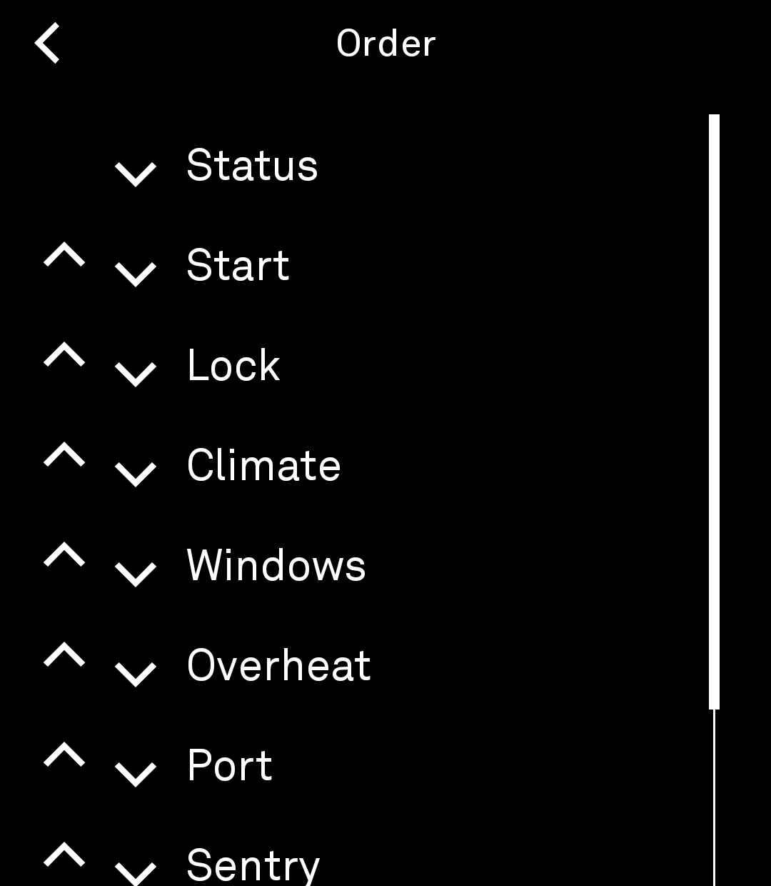
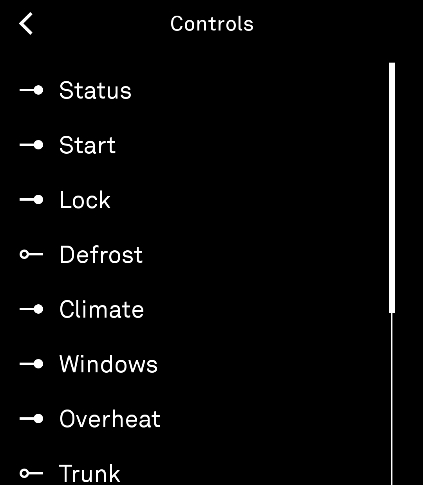
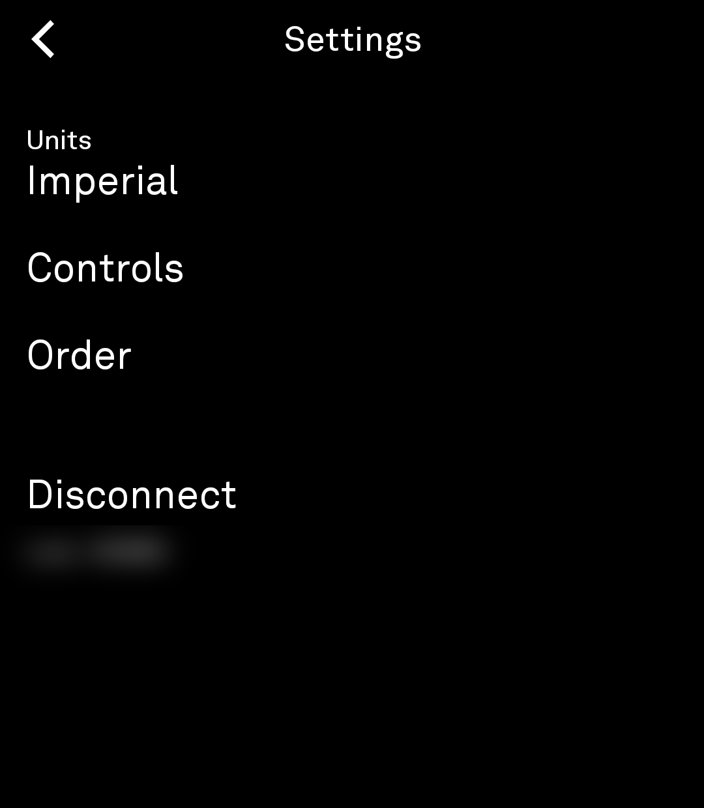
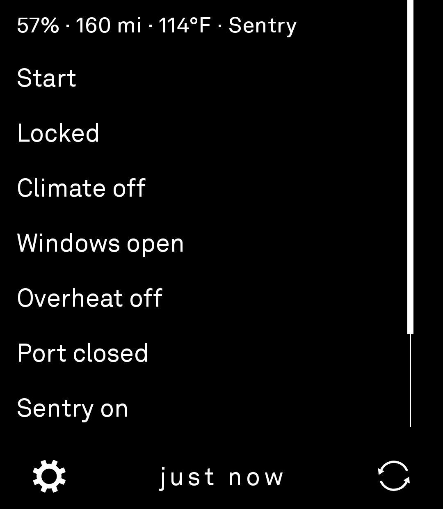
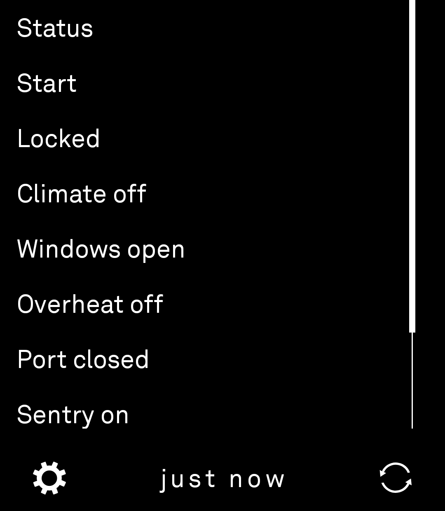

# Tesla for Light Phone 3

Control your Tesla from your Light Phone 3. Lock, unlock, climate, trunk, sentry mode, and more — no smartphone needed.

<p align="center">
  
  
  
  
  
</p>

## Quick Start

1. Create a Tesla developer app at [developer.tesla.com](https://developer.tesla.com)
2. Get your credentials onto the Light Phone (QR code or manual entry)
3. Sign in with your Tesla account directly on the phone
4. Pair the app's encryption key with your vehicle (scan a QR code with your smartphone)

See the full **[Setup Guide](tool/SETUP_GUIDE.md)** for step-by-step instructions, or visit **[tesla-lightphone.app/setup](https://tesla-lightphone.app/setup)** for the interactive setup page.

## What This Is

A Tesla remote control tool built for the Light Phone 3 using the [Light SDK](https://github.com/lightphone/light-sdk). It uses Tesla's Fleet API with end-to-end encrypted vehicle commands (VCP) — your credentials never leave your device.

Each user creates their own Tesla developer account. The app connects directly to Tesla — no intermediary server, no shared credentials.

## Features

- Lock / Unlock
- Climate on/off, defrost, overheat protection
- Open/close trunk and frunk
- Charge port open/close
- Sentry mode on/off
- Flash lights, honk horn
- Vent/close windows
- Remote start (2-minute drive window)
- Real-time vehicle status (battery, temperature, location)

## Privacy & Security

- **All credentials stay on your device.** The app only talks to Tesla's servers.
- **Each user creates their own Tesla developer account** — no shared credentials, no third-party access.
- **End-to-end encrypted commands** via Tesla Vehicle Command Protocol (VCP).
- **The setup website is static HTML + JavaScript** — no backend, no database. QR codes are generated entirely in your browser. [Verify in the source](docs/setup.html).
- **No analytics, no tracking, no background activity.**
- **Open source** — you can read every line.

## Repo Structure

- **`tool/`** — The Tesla tool source code (this is the app)
- **`docs/`** — The setup website hosted at tesla-lightphone.app

Everything else (`sdk/`, `plugin/`, `gradle/`, etc.) is the Light SDK build system.

## Building from Source

If you want to build the app yourself:

```bash
export JAVA_HOME=$(/usr/libexec/java_home -v 17)   # Mac
./gradlew :tool:assembleDebug
```

The APK will be at `tool/build/outputs/apk/debug/tool-debug.apk`.

Install with:
```bash
adb install -r tool/build/outputs/apk/debug/tool-debug.apk
```

## Cost

Tesla charges per API call, but every developer account gets a **$10/month credit** applied automatically. Normal personal use costs well under $1/month, so the credit covers it easily. No payment method required to get started.

## FAQ

**Why do I need my own developer account?**
Privacy (your credentials stay yours — sign-in goes directly to Tesla, never through a third-party server), cost (each account gets a $10/month credit that covers personal use), and control (revoke access anytime at developer.tesla.com).

**Why does the developer app ask for a website URL?**
Tesla requires every developer app to list an Allowed Origin and Redirect URI. These are part of the OAuth standard — the secure sign-in process used by Tesla, Google, Apple, and most major services. Think of them like a return address on an envelope: Tesla uses them to verify the sign-in request is legitimate. Your credentials never pass through that website — the connection is directly between your phone and Tesla.

**What API permissions (scopes) does the app use?**
- **Vehicle Information** — Read your car's status: battery, temperature, location, tire pressure.
- **Vehicle Commands** — Send commands: lock/unlock, climate, trunk/frunk, sentry mode, flash lights, remote start.
- **Vehicle Charging Management** (optional) — Manage charging: start/stop, set limits, schedule.

**Why not a single shared app instead of individual developer accounts?**
Privacy and cost. A shared account would require a server to handle sign-ins — meaning tokens would pass through infrastructure outside your control. And Tesla charges per API call with a $10/month credit per account; with many users on one account, those costs add up and fall on the developer. Your own account keeps everything direct and free.

**Is the QR code safe?**
Yes. It's generated entirely by JavaScript in your browser — nothing is sent to any server. You can disconnect from the internet before entering your credentials and it still works. You can also generate the QR from your terminal, or skip it entirely with manual entry.

**What if I don't have a computer?**
Use manual entry — type your Client ID and Client Secret directly into the app on your Light Phone.

For more questions, see the full **[FAQ page](https://tesla-lightphone.app/faq)**.

## Credits

Built on the [Light SDK](https://github.com/lightphone/light-sdk) by The Light Phone, Inc.
